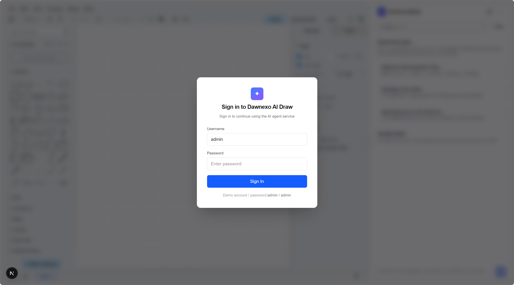
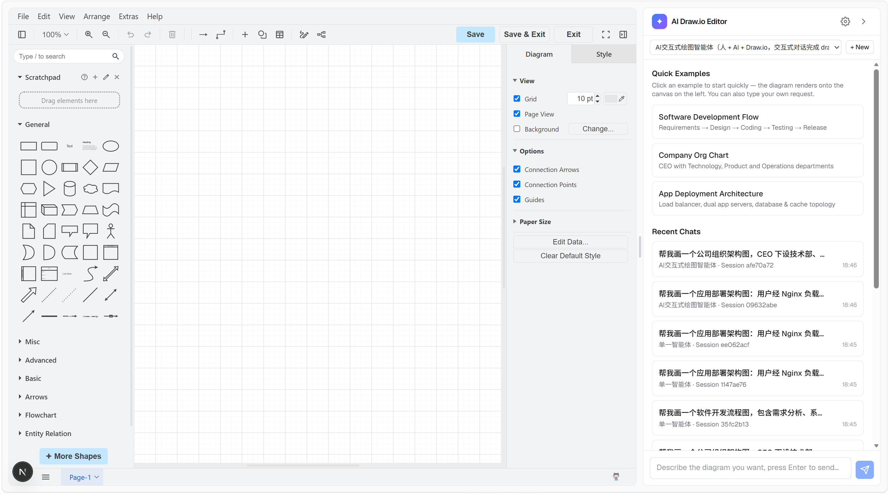
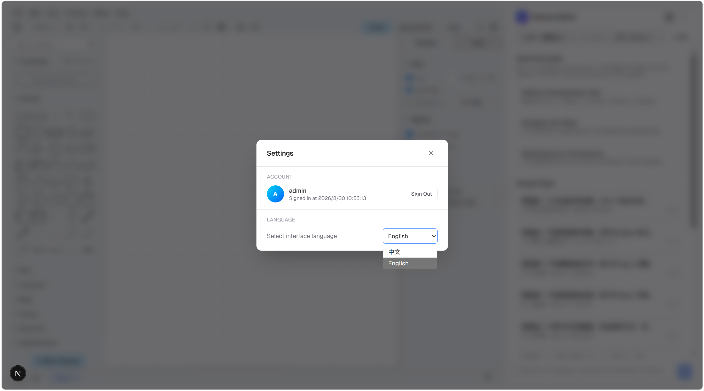

# Dawnexo AI Draw Frontend · Smart Diagram Generator

简体中文 | [English](./README.en.md)

The frontend of an AI-chat-powered draw.io diagram generator, working with its companion backend [dawnexo-ai-drawio-backend](https://github.com/PhotonYao/dawnexo-ai-drawio-backend): describe a diagram in natural language and the AI agent generates draw.io XML that renders onto the canvas automatically.

## Screenshots

**Sign in**



**Main view: draw.io canvas + chat sidebar (Quick Examples / Recent Chats)**



**Settings (account / interface language)**



## Features

- **Login interception**: the cookie-based session (`ai_agent_login`) is checked on entry; a login dialog pops up when not signed in, and the session lasts 7 days (demo account `admin / admin`)
- **Quick examples**: 3 preset diagram examples; clicking one builds a local conversation and renders the canvas (a session is created, without calling the chat API)
- **Agent chat**: integrates the backend `query_ai_agent_config_list` / `create_session` / `chat` APIs; agent replies are parsed from the `{type, content}` structure (`user` asks for more details, `drawio` carries diagram XML), with tolerant handling of real-world output such as Markdown wrapping, trailing JSON blocks and escape errors
- **Diagram rendering**: draw.io XML renders automatically onto the `DrawIoEmbed` canvas on the left, and is also shown in the chat bubble as a collapsible code block (auto-collapsed when long, with copy support)
- **Recent chats**: the last 20 conversations are stored locally (localStorage, isolated per user); clicking restores messages, session and canvas; titles can be renamed, records deleted, and a save prompt appears before starting a new chat when the canvas has content
- **Bilingual UI**: switch the interface language (中文 / English) in Settings — UI text, the browser tab title and the draw.io editor UI all switch together, and the preference is persisted
- **Resizable sidebar**: the chat sidebar width is draggable (200px ~ 50% of the window; dragging to the minimum collapses it)
- **Session isolation**: the `sessionId` returned by the server is the source of truth, combined with server-side session ownership validation to prevent cross-contamination between conversations

## Tech Stack

- Next.js 16 (App Router) / React 19 / TypeScript
- Tailwind CSS v4
- [react-drawio](https://www.npmjs.com/package/react-drawio) (embedded draw.io editor)

## Project Structure

```
app/
├── api/            # Backend API client (agent.ts: unified request wrapper + three APIs)
├── config/         # Configuration & constants
│   ├── api-config.ts   # Backend API base URL, login cookie settings
│   ├── i18n.ts         # zh/en UI dictionary, tab titles
│   ├── examples.ts     # Quick examples (preset draw.io XML)
│   └── diagram-xml.ts  # Initial/empty canvas XML
├── types/          # API type definitions (api.ts)
├── utils/          # Utilities (cookies, draw.io XML extraction, reply parsing, recent-chat storage)
└── components/     # Components (ChatPanel / DrawIoEditor / AuthGate / LoginDialog / SettingsDialog / NewChatDialog / CodeBlock)
```

## Getting Started

```bash
npm install
npm run dev
```

Open [http://localhost:3000](http://localhost:3000) and sign in with the demo account `admin / admin`.

## Configuration

- The backend base URL, API prefix and login cookie name are managed in [app/config/api-config.ts](app/config/api-config.ts) (defaults to `http://127.0.0.1:8090`; start the backend service first);
- The diagram agent is driven by the backend's `agent-draw-io.yml` configuration.

## Available Scripts

```bash
npm run dev     # Development mode (Turbopack hot reload)
npm run build   # Production build
npm run start   # Run the production build
npm run lint    # ESLint check
```
